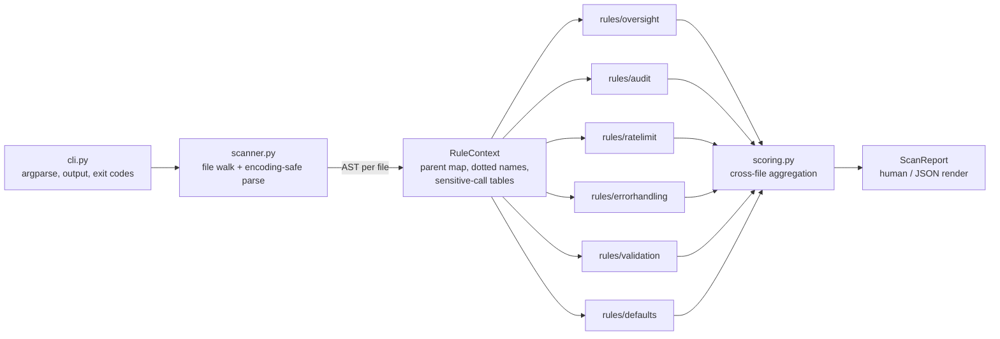

<div align="center">

# 🛡️ agentgauge

**A zero-dependency static governance scanner for MCP servers and AI agent code — a linter for the OWASP Agentic Top 10.**

*Point it at any Python repo. Get a 0–100 governance score, specific findings, and concrete fixes — without executing a single line of the scanned code.*

[](https://github.com/PreethamNoelP/agentgauge/actions/workflows/ci.yml)


</div>

---

## 📷 Demo

```console
$ python -m agentgauge tests/fixtures/vulnerable_server.py

agentgauge: tests/fixtures/vulnerable_server.py
scanned 1 Python file(s)

  Human oversight                      0.0 / 25  (0/3 sites passed)
  Audit logging                        0.0 / 20  (0/3 sites passed)
  Rate limiting                        0.0 / 15  (0/3 sites passed)
  Error handling                       0.0 / 15  (0/4 sites passed)
  Tool scope & input validation        0.0 / 15  (0/2 sites passed)
  Permissive defaults                  0.0 / 10  (0/1 sites passed)
  ----------------------------------------------------------
  GOVERNANCE SCORE                     0.0 / 100

Findings (16):

  vulnerable_server.py:11  [permissive-defaults]
    permissive default: 'auto_approve=True' disables a safety control
    fix: Set auto_approve=False and require explicit per-action opt-in instead

  vulnerable_server.py:17  [human-oversight]
    file delete call 'shutil.rmtree' in 'delete_path' has no human-approval check in scope
    fix: Gate the call behind an explicit approval, e.g. `if not request_approval(...): return` before it executes
  ...
```

Every finding names the file, line, rule, and — critically — **the fix**.

---

## 🧠 The Problem

AI agents are being wired to real tools at breakneck speed: shell access, file deletion, payments, database writes. The OWASP Agentic Top 10 catalogs how this goes wrong — excessive agency, missing human oversight, no audit trail, unbounded tool loops.

Yet there is no `flake8` for agent governance. Security reviews of MCP servers and tool-calling code are manual, inconsistent, and usually happen *after* something scary ships. Teams need an answer to a simple question — **"would this agent codebase pass a governance audit?"** — that runs in seconds, in CI, on every commit.

## 💡 The Solution

**agentgauge** is that linter. It parses Python source with the standard library's `ast` module — no regex soup, no code execution, no network calls — and checks every *site* that matters (sensitive calls, tool functions, risky parameters) against six weighted governance categories:

| Category | Weight | The question it asks |
|---|---|---|
| 🧍 Human oversight | 25 | Does every sensitive action (file delete, shell exec, payment…) have an approval check in scope? |
| 📜 Audit logging | 20 | Does every tool function record what it did? |
| ⏱️ Rate limiting | 15 | Can a runaway loop call this tool 10,000 times? |
| 🧯 Error handling | 15 | Exit-free `while True` loops? Sensitive calls without `try/except`? |
| 🔎 Input validation | 15 | Are risky parameters (`path`, `cmd`, `query`, `url`…) validated before use? |
| ⚠️ Permissive defaults | 10 | Is `auto_approve=True` quietly baked in? |

What makes it different:

- **Site-based scoring, not file-based.** A category's score is the fraction of *applicable* sites that pass — a category with zero applicable sites scores full marks, because you can't fail a check that never applied.
- **Honest about its limits.** Every heuristic's blind spots are documented in [RULES.md](RULES.md). A governance tool that hides its own blind spots would fail its own audit.
- **Built for CI from day one.** Deterministic exit codes, `--min-score` gating, `--json` output.

## ✨ Key Features

- 🚫 **Zero dependencies** — pure Python 3.11+ standard library; `pytest` needed only for the test suite
- 🔒 **Never executes scanned code** — pure AST analysis, safe to run on untrusted or hostile repos
- 🎯 **Actionable findings** — every finding ships with a concrete, copy-adaptable fix
- 🧮 **Weighted 0–100 score** — one number a team can put a threshold on
- 🤖 **CI-native** — `--min-score 70` fails the build; exit code `2` guards against the "scanned zero files, passed anyway" trap
- 📦 **JSON output** — pipe reports into dashboards, bots, or PR comments
- 🐕 **Dogfooded** — agentgauge's own CI gates every push with agentgauge

## 🏗️ Architecture

<!-- TODO: optionally replace with a rendered architecture image -->



Design decisions that matter:

- **Each rule is a plug-in** exposing `RULE_ID`, `CATEGORY`, `WEIGHT`, and `check(ctx) → (sites, passed, findings)`. Adding a seventh category means adding one file and registering it — nothing else changes.
- **Shared AST plumbing lives in one place** ([astutils.py](agentgauge/astutils.py)): parent maps for "is there an approval check *in scope*?", dotted-name resolution for `subprocess.run` vs bare `run`, and the sensitive-call vocabulary tables.
- **Scoring semantics live in the models**, not the rules — rules report facts; [models.py](agentgauge/models.py) turns facts into numbers.
- **Performance:** single-pass AST walk per file, no I/O beyond reading sources. The full 74-test suite — including end-to-end scans — runs in **under half a second**.

## ⚙️ Tech Stack

| Layer | Choice |
|---|---|
| 🐍 Language | Python 3.11+ (3.11 / 3.12 / 3.13 tested in CI) |
| 🌳 Analysis | `ast` standard-library module — pure static parsing |
| 🖥️ CLI | `argparse`, human + `--json` renderers |
| ✅ Testing | `pytest` — 74 unit, per-rule, and integration tests |
| 🔁 CI/CD | GitHub Actions, 3-version matrix + self-scan gate |
| 📦 Runtime deps | **None.** |

## 📊 How It Works

1. **Walk** — [scanner.py](agentgauge/scanner.py) collects `.py` files (skip lists for venvs, caches), parses each with `ast.parse` using encoding-safe reads.
2. **Contextualize** — [astutils.py](agentgauge/astutils.py) builds a parent map and resolves dotted call names, then classifies *sites*: sensitive calls (`shutil.rmtree`, `subprocess.run`, payment APIs…), tool functions, risky parameters.
3. **Check** — each of the six rules inspects its sites: vocabulary matching for oversight/logging/rate-limiting, structural analysis for error handling, name-based taint-style checks for validation.
4. **Score** — [scoring.py](agentgauge/scoring.py) aggregates across files: `category score = weight × (passed sites / applicable sites)`; total is the sum over categories.
5. **Report** — findings with file, line, rule ID, message, and fix; rendered for humans or as JSON; exit code encodes the CI verdict.

Exit codes (the CI contract):

| Code | Meaning |
|---|---|
| `0` | scan completed (and met `--min-score`, if given) |
| `1` | score below `--min-score` |
| `2` | bad invocation: target missing, or **zero Python files scanned** — a score over zero evidence is never reported as a pass |

## 🛠️ Installation & Setup

**Prerequisites:** Python 3.11+ — nothing else.

```console
$ git clone https://github.com/PreethamNoelP/agentgauge.git
$ cd agentgauge
$ python -m agentgauge --help
```

That's the whole install — zero dependencies means there is no step 3. (PyPI packaging is on the [roadmap](#-future-improvements).)

To run the test suite:

```console
$ pip install pytest
$ python -m pytest tests/
```

## ▶️ Usage

```console
$ python -m agentgauge path/to/repo                  # scan a whole repo
$ python -m agentgauge path/to/server.py             # or a single file
$ python -m agentgauge path/to/repo --json           # machine-readable report
$ python -m agentgauge path/to/repo --min-score 70   # CI gate: exit 1 below 70
```

As a GitHub Actions gate in any project:

```yaml
- name: Governance scan
  run: python -m agentgauge . --min-score 70
```

> Scanning agentgauge's own repository will flag `tests/fixtures/vulnerable_server.py` — it is *supposed* to be terrifying.

## 📈 Results & Validation

- ✅ **74 tests, 100% passing, < 0.5 s** — unit tests per module, per-rule tests, and end-to-end integration scans
- 🎯 **Calibrated end to end** — a deliberately vulnerable fixture server scores exactly **0.0/100** (16 findings); a deliberately hardened one scores exactly **100.0/100**. The full score range is provably exercised, not theoretical.
- 🐕 **Dogfooded in CI** — every push must pass `agentgauge --min-score 100` on the clean fixture across Python 3.11, 3.12, and 3.13
- 🔍 **16 distinct finding types** demonstrated on the vulnerable fixture, each with a concrete fix

## 🔍 Challenges & Learnings

Real problems this project had to solve — documented with their remaining limitations in [RULES.md](RULES.md):

- **A `break` is not an exit.** Deciding whether a `while True` loop can terminate means distinguishing a `break` that exits *this* loop from one that exits a loop nested inside it — pure AST structure, no execution.
- **A `try` body is not its handler.** Naively checking "is this call inside a `try`?" passes calls that live in the `except` block. The error-handling rule walks the AST to tell the protected region apart from the recovery region.
- **Heuristics must confess.** Vocabulary-based checks can be fooled — an unused `approved = request_approval()` variable passes the oversight check today. Instead of hiding that, RULES.md documents every known false pass/false fail and the planned fix. *Trust is a feature.*
- **Never score zero evidence.** An early design scored an empty scan as 100/100. The exit-code contract now treats "zero files scanned" as an invocation error — a governance tool must not hand out passing grades for silence.

## 🚀 Future Improvements

- [ ] **Enforcing-position analysis** — require approval vocabulary to actually gate execution (kills the dead-variable false pass without full data-flow analysis)
- [ ] **PyPI packaging** — `pip install agentgauge` + an `agentgauge` console command
- [ ] **Configurable vocabularies** — custom approval / logging / rate-limit / flag-name keyword lists
- [ ] **Type-annotation evidence** — read `Literal` and Pydantic `Field` constraints as validation proof
- [ ] **Config-file scanning** — catch permissive defaults living in `claude_desktop_config.json`, `mcp.json`, …
- [ ] **Import-alias resolution** — see through `import subprocess as sp; sp.run(...)`
- [ ] **`assume_external_rate_limiting`** — for deployments fronted by an API gateway

## 🤝 Contributing

Contributions are welcome — especially new rules and vocabulary improvements.

1. Fork and branch from `main`
2. Each rule is self-contained under [agentgauge/rules/](agentgauge/rules/) — follow the `check(ctx) → (sites, passed, findings)` contract
3. Add tests (per-rule + a fixture case) and keep `python -m pytest tests/` green
4. Open a PR — CI must pass, including the self-scan gate

## 📄 License

Released under the [MIT License](LICENSE).

## 👤 Author

**Preetham Noel P**

- GitHub: [@PreethamNoelP](https://github.com/PreethamNoelP)
- LinkedIn: [linkedin.com/in/preethamnoelp](https://www.linkedin.com/in/preethamnoelp)

---

<div align="center">
<sub>If this project is useful to you, a ⭐ helps others find it.</sub>
</div>