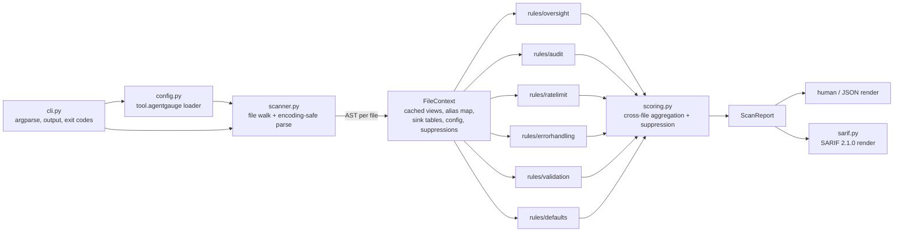

<div align="center">

# 🛡️ agentgauge

**A zero-dependency static governance scanner for MCP servers and AI agent code — a linter for the OWASP Agentic Top 10.**

*Point it at any Python repo. Get a 0–100 governance score, specific findings, and concrete fixes — without executing a single line of the scanned code.*

[](https://github.com/PreethamNoelP/agentgauge/actions/workflows/ci.yml)


</div>

---

## 📷 Demo

```console
$ agentgauge tests/fixtures/vulnerable_server.py

agentgauge: tests/fixtures/vulnerable_server.py
scanned 1 Python file(s)

  Human oversight                      0.0 / 25  (0/9 sites passed)
  Audit logging                        0.0 / 20  (0/8 sites passed)
  Rate limiting                        0.0 / 15  (0/8 sites passed)
  Error handling                       0.0 / 15  (0/10 sites passed)
  Tool scope & input validation        0.0 / 15  (0/7 sites passed)
  Permissive defaults                  0.0 / 10  (0/2 sites passed)
  ----------------------------------------------------------
  GOVERNANCE SCORE                     0.0 / 100
  VERDICT                           FAIL_CRITICAL

Findings (44):

  tests/fixtures/vulnerable_server.py:16  [permissive-defaults]
    permissive default: 'auto_approve=True' disables a safety control
    fix: Set auto_approve=False and require explicit per-action opt-in instead

  tests/fixtures/vulnerable_server.py:24  [human-oversight]
    file delete call 'shutil.rmtree' in 'delete_path' has no human-approval check in scope
    fix: Gate the call behind an explicit approval, e.g. `if not request_approval(...): return` before it executes
  ...
```

Every finding names the file, line, rule, and — critically — **the fix**.

---

## 🧠 The Problem

AI agents are being wired to real tools at breakneck speed: shell access, file deletion, payments, database writes. The OWASP Agentic Top 10 catalogs how this goes wrong — excessive agency, missing human oversight, no audit trail, unbounded tool loops.

Yet there is no `flake8` for agent governance. Security reviews of MCP servers and tool-calling code are manual, inconsistent, and usually happen *after* something scary ships. Teams need an answer to a simple question — **"would this agent codebase pass a governance audit?"** — that runs in seconds, in CI, on every commit.

## 💡 The Solution

**agentgauge** is that linter. It parses Python source with the standard library's `ast` module — no regex soup, no code execution, no network calls — and checks every *site* that matters (sensitive calls, tool functions, risky parameters) against six weighted governance categories:

| Category | Weight | The question it asks |
|---|---|---|
| 🧍 Human oversight | 25 | Does every sensitive action (file delete, shell exec, payment…) have an approval check in scope? |
| 📜 Audit logging | 20 | Does every tool function record what it did? |
| ⏱️ Rate limiting | 15 | Can a runaway loop call this tool 10,000 times? |
| 🧯 Error handling | 15 | Exit-free `while True` loops? Sensitive calls without `try/except`? |
| 🔎 Input validation | 15 | Are risky parameters (`path`, `cmd`, `query`, `url`…) validated before use? |
| ⚠️ Permissive defaults | 10 | Is `auto_approve=True` quietly baked in? |

What makes it different:

- **Site-based scoring, not file-based.** A category's score is the fraction of *applicable* sites that pass — a category with zero applicable sites scores full marks, because you can't fail a check that never applied.
- **Two-tier verdict, not just a score.** The 0-100 score is an average across every site, which means one catastrophic miss can hide behind a hundred compliant ones — 99 fully-governed payment tools and 1 with no approval check still average out to 99.75/100. So alongside the score, every scan produces a `verdict`: `PASS`, `FAIL_CRITICAL`, or `INCOMPLETE`. A single ungated **critical** action — payment, file deletion, shell exec, code exec, remote delete — sets `FAIL_CRITICAL` and fails CI outright, independent of `--min-score` and no matter how high the aggregate score climbs. The score tells you your general posture; the verdict tells you whether to ship.
- **Nothing can quietly buy back that verdict.** Not a high score, not an inline suppression comment, not a config file that switches off the rule the gate depends on. Each of those was a real hole; each is now closed and regression-tested.
- **Honest about its limits.** Every heuristic's blind spots are documented in [RULES.md](RULES.md) — including the ones that are embarrassing, and including the fact that 50 of the 100 points rest on governance *vocabulary* appearing near a tool function rather than on proof it does anything. That is why the verdict, not the score, is what belongs in a CI gate. A governance tool that hides its own blind spots would fail its own audit.
- **Built for CI from day one.** Deterministic exit codes, deterministic output, `--min-score` gating, `--fail-on-incomplete`, JSON and SARIF.

## ✨ Key Features

- 🚫 **Zero dependencies** — pure Python 3.11+ standard library (config parsing uses stdlib `tomllib`); `pytest` needed only for the test suite
- 🔒 **Never executes scanned code** — `ast.parse` and `tokenize` only, safe to run on untrusted or hostile repos
- 🎯 **Actionable findings** — every finding ships with a concrete, copy-adaptable fix
- 🧮 **Weighted 0–100 score** — one number a team can put a threshold on
- 🤖 **CI-native** — `--min-score 70` fails the build; exit `2` guards against the "scanned zero files, passed anyway" trap; `--fail-on-incomplete` guards against the quieter "scanned *most* files, passed anyway" one
- 📦 **JSON or SARIF 2.1.0** — pipe reports into dashboards, bots, PR comments, or GitHub/GitLab code scanning
- ⚙️ **Configurable, never overridable** — `[tool.agentgauge]` in pyproject.toml adds project vocabulary, excludes, and disables categories; it can never make a rule stop recognizing its built-in defaults, and a config that would neuter a rule is rejected rather than honored
- 🙈 **Inline suppression** — `# agentgauge: ignore[rule-id]` for incremental adoption, without ever weakening `FAIL_CRITICAL`
- 🐕 **Dogfooded, including the negative case** — CI fails if the vulnerable fixture ever stops being detected

## 🏗️ Architecture


```mermaid
flowchart LR
    CFG[config.py<br/>tool.agentgauge loader] --> SC
    CLI[cli.py<br/>argparse, output, exit codes] --> SC[scanner.py<br/>file walk + encoding-safe parse]
    CLI --> CFG
    SC -->|AST per file| CTX[FileContext<br/>cached views, alias map,<br/>sink tables, config, suppressions]
    CTX --> R1[rules/oversight]
    CTX --> R2[rules/audit]
    CTX --> R3[rules/ratelimit]
    CTX --> R4[rules/errorhandling]
    CTX --> R5[rules/validation]
    CTX --> R6[rules/defaults]
    R1 & R2 & R3 & R4 & R5 & R6 --> AG[scoring.py<br/>cross-file aggregation + suppression]
    AG --> REP[ScanReport]
    REP --> OUT1[human / JSON render]
    REP --> OUT2[sarif.py<br/>SARIF 2.1.0 render]
```

Design decisions that matter:

- **Each rule is a plug-in** exposing `RULE_ID`, `CATEGORY`, `WEIGHT`, and `check(ctx) → (sites, passed, findings)`. Adding a seventh category means adding one file and registering it. See [CONTRIBUTING.md](CONTRIBUTING.md) for the invariants scoring relies on.
- **Shared AST plumbing lives in one place** ([astutils.py](agentgauge/astutils.py)): the sink vocabulary, alias resolution, scope walking, suppression parsing, and the cached per-file views (`functions`, `sensitive_calls`, `tool_functions`, `parents`) that keep six rules from re-walking the same trees.
- **Scoring semantics live in the models**, not the rules — rules report facts; [models.py](agentgauge/models.py) turns facts into numbers. Suppression, disabled rules, and scan warnings live in [scoring.py](agentgauge/scoring.py) as scan-wide concerns.
- **Output rendering is decoupled from scoring** — [sarif.py](agentgauge/sarif.py) renders a `ScanReport` without `scoring.py` knowing SARIF exists.

## ⚙️ Tech Stack

| Layer | Choice |
|---|---|
| 🐍 Language | Python 3.11+ (3.11 / 3.12 / 3.13 on Linux and Windows in CI) |
| 🌳 Analysis | `ast` + `tokenize` standard-library modules — pure static parsing |
| ⚙️ Config | `tomllib` standard-library module — `[tool.agentgauge]` in pyproject.toml |
| 🖥️ CLI | `argparse`, human + `--json` + `--sarif` renderers |
| ✅ Testing | `pytest` — 880+ unit, per-rule, invariant, and integration tests |
| 🔁 CI/CD | GitHub Actions, 6-entry matrix + four dogfood gates |
| 📦 Runtime deps | **None.** |

## 📊 How It Works

1. **Walk** — [scanner.py](agentgauge/scanner.py) collects `.py` files (skip lists for venvs and caches, matched relative to the scan root), parses each with `ast.parse` using encoding-safe reads. Anything unparseable is recorded and skipped, which makes the verdict `INCOMPLETE`.
2. **Contextualize** — [astutils.py](agentgauge/astutils.py) resolves call names through the file's import and rebinding aliases, then classifies *sites*: sensitive calls (`shutil.rmtree`, `subprocess.run`, `Path(p).unlink()`, payment APIs…), tool functions, risky parameters.
3. **Check** — each of the six rules inspects its sites: vocabulary matching for oversight/logging/rate-limiting, structural analysis for error handling, name-based checks for validation.
4. **Score** — [scoring.py](agentgauge/scoring.py) aggregates across files: `category score = weight × (passed sites / applicable sites)`. Independently, `verdict` is `FAIL_CRITICAL` if any finding is on a critical sink, `INCOMPLETE` if coverage was reduced, else `PASS`.
5. **Report** — findings with file, line, rule id, message, fix, and a `critical` flag; rendered for humans, as JSON, or as SARIF; exit code encodes the verdict.

Exit codes (the CI contract):

| Code | Meaning |
|---|---|
| `0` | scan completed, met `--min-score` (if given), and verdict is not `FAIL_CRITICAL` |
| `1` | score below `--min-score`, **or** verdict is `FAIL_CRITICAL`, **or** verdict is `INCOMPLETE` and `--fail-on-incomplete` was passed |
| `2` | bad invocation: target missing, **zero Python files scanned**, or a malformed/unrecognized `[tool.agentgauge]` config — a score over zero evidence, or over a config agentgauge couldn't understand, is never reported as a pass |

## 🛠️ Installation & Setup

**Prerequisites:** Python 3.11+ — nothing else.

```console
$ pip install git+https://github.com/PreethamNoelP/agentgauge.git
$ agentgauge --version
```

That's the whole install — zero dependencies means there is no step 3. (A plain `pip install agentgauge` from PyPI is on the [roadmap](#-future-improvements).)

For development, clone instead:

```console
$ git clone https://github.com/PreethamNoelP/agentgauge.git
$ cd agentgauge
$ pip install -e ".[dev]"
$ python -m pytest tests/ -q
```

## ▶️ Usage

```console
$ agentgauge .                             # scan a repo from its root
$ agentgauge path/to/server.py             # or a single file
$ agentgauge . --json                      # machine-readable report
$ agentgauge . --sarif                     # SARIF 2.1.0, for code-scanning dashboards
$ agentgauge . --min-score 70              # CI gate: exit 1 below 70
$ agentgauge . --fail-on-incomplete        # CI gate: exit 1 if coverage was reduced
$ agentgauge . --config custom.toml        # explicit config instead of discovery
```

(`python -m agentgauge` works identically if you prefer module invocation.)

Run it from the repository root. Findings are reported relative to the working directory, which is what a SARIF upload needs to map a result back to a file.

### ⚙️ Configuration

Drop a `[tool.agentgauge]` table in `pyproject.toml` next to the scan
target to tune vocabulary, excludes, and per-rule behavior without forking
source — a scan with no config file behaves identically to one with an
empty table:

```toml
[tool.agentgauge]
min_score = 80
exclude = ["tests/*", "**/generated_*.py", "vendor/"]
disabled_rules = ["rate-limiting"]     # category removed; max score drops below 100
assume_external_rate_limiting = false  # true if a gateway already rate-limits
extra_approval_markers = ["vet", "greenlight"]
extra_log_tokens = ["telemetry"]
```

Config validation is strict: an unrecognized key, an unknown rule id, or a
vocabulary entry short enough to match everything is a usage error, not a
silent no-op. Full key reference, pattern semantics, and precedence rules
(`--min-score` beats config; `--config` beats discovery; discovery does not
search upwards) are in [RULES.md](RULES.md#configuration). The report names
the config file it actually applied, so a config that isn't being picked up
is visible rather than mysterious.

Findings can be suppressed inline for incremental adoption —
`# agentgauge: ignore[human-oversight]` on the offending line — but a
suppressed finding on a critical sink still forces `FAIL_CRITICAL`, and a
malformed marker suppresses nothing rather than everything. See
[RULES.md](RULES.md#suppressing-individual-findings).

### GitHub Actions

As a gate:

```yaml
- name: Governance scan
  run: |
    pip install git+https://github.com/PreethamNoelP/agentgauge.git
    agentgauge . --min-score 70 --fail-on-incomplete
```

Or into GitHub code scanning:

```yaml
- name: Governance scan (SARIF)
  run: |
    pip install git+https://github.com/PreethamNoelP/agentgauge.git
    agentgauge . --sarif > agentgauge.sarif || true
- uses: github/codeql-action/upload-sarif@v3
  with:
    sarif_file: agentgauge.sarif
```

> Scanning agentgauge's own repository will flag `tests/fixtures/vulnerable_server.py` — it is *supposed* to be terrifying. The repo's own `[tool.agentgauge]` table excludes `tests/`, and CI gates the fixtures separately.

## 📈 Results & Validation

- ✅ **880+ tests, 100% passing, < 2 s** — per-module, per-rule, invariant/property, and end-to-end integration
- 🎯 **Calibrated end to end** — a deliberately vulnerable fixture scores exactly **0.0/100** (44 findings across all six categories); a deliberately hardened one scores exactly **100.0/100** with every category having at least one site. Both ends of the range are pinned, not theoretical.
- 🧪 **Property tests, not just examples** — `sites == passed + findings` for every rule over a 45-snippet corpus (match statements, `except*`, walrus, unicode identifiers, async comprehensions), score bounds, byte-identical output across repeated runs, and a pinned JSON key contract
- 🐕 **Four dogfood gates in CI** — own source scores 100 with a complete scan; the clean fixture is not a false positive; **the vulnerable fixture still fails** (the gate that catches a silent detection regression); JSON and SARIF parse and a hostile repo doesn't crash the scan
- 🪟 **Linux and Windows in CI** — path handling, glob case sensitivity and encoding detection have all been platform-specific bugs here

## 🔍 Challenges & Learnings

Real problems this project had to solve — documented with their remaining limitations in [RULES.md](RULES.md):

- **A `break` is not an exit.** Deciding whether a `while True` loop can terminate means distinguishing a `break` that exits *this* loop from one that exits a loop nested inside it — pure AST structure, no execution.
- **A `try` body is not its handler.** Naively checking "is this call inside a `try`?" passes calls that live in the `except` block. The error-handling rule walks the AST to tell the protected region apart from the recovery region.
- **A name is not a target.** `from subprocess import run; run(cmd, shell=True)` resolves to the bare name `run`, which the sink table excludes as far too generic — so for a while, a file that shelled out scored a clean 100/100. Sinks are now resolved through the file's full alias map: plain from-imports, `as`-imports, and one hop of rebinding (`rm = shutil.rmtree`).
- **"In scope" has to mean *this* scope.** A module-level `os.system()` was satisfied by any unrelated function in the same file that happened to mention approval — silencing `FAIL_CRITICAL` on a real sink. An approval signal now only counts where it actually runs.
- **A suppression is not an amnesty — and a malformed one is not a blanket.** `# agentgauge: ignore[]` failed to match the bracketed form of the marker, fell through to the bare form, and suppressed *every* rule on the line. Reading "suppress nothing" as "suppress everything" is the worst possible direction for a security-sensitive feature.
- **Config must not be able to switch off the gate.** `disabled_rules = ["human-oversight"]` removed the only rule that marks findings critical, so an ungated `shutil.rmtree` reported `PASS` and exited 0 — the same dilution the verdict exists to prevent, arriving through a config file instead of through averaging.
- **Never score zero evidence.** An early design scored an empty scan as 100/100. Zero files scanned is now an invocation error — and zero applicable *sites* now says so out loud, because 100/100 over nothing to check is arithmetic, not a clean bill of health.
- **Measure before optimizing, then actually optimize.** 123k LOC took 59 seconds. Profiling put nearly all of it in `ast.walk`, called from six rules independently re-deriving the same three facts. Caching those on the context — and computing the tool-function set by walking *up* from known sinks instead of down through every function — took it to 25s without changing a single rule's shape.

## 🚀 Future Improvements

- [x] **Configurable vocabularies** — custom approval / logging / rate-limit / validation / flag-name keyword lists via `[tool.agentgauge]`
- [x] **Type-annotation evidence** — `Literal[...]` and `Annotated[..., Field(...)]` count as validation proof
- [x] **Alias resolution** — `import x as y`, `from x import y`, and one hop of rebinding
- [x] **Enforcing-position analysis** — approval vocabulary must gate execution, in the call's own scope
- [x] **Inline suppression** — `# agentgauge: ignore[rule-id]`, without weakening `FAIL_CRITICAL`
- [x] **SARIF output** — `--sarif` with a full invocation record for code-scanning ingestion
- [ ] **Publish to PyPI** — plain `pip install agentgauge`, no git URL needed
- [ ] **Config-file scanning** — catch permissive defaults living in `claude_desktop_config.json`, `mcp.json`, …
- [ ] **Pydantic/FastMCP schema awareness** — validate declared input models, not just parameters (the largest remaining rule-5 blind spot)
- [ ] **Cross-module resolution** — a sink gated by a helper in another file is currently a false failure
- [ ] **Plugin/entry-point rule system** — third-party rules without forking source
- [ ] **New OWASP categories** — secrets/credential exposure, SSRF, excessive tool scope (would rebalance the 100-point weight model)

## 🤝 Contributing

Contributions are welcome — especially new rules, vocabulary, and reports of false positives or false negatives. See [CONTRIBUTING.md](CONTRIBUTING.md) for the rule contract, the invariants scoring relies on, and the bar for a change (short version: every behavior change needs a test that pins the wrong answer the old code gave).

Security issues: [SECURITY.md](SECURITY.md) — which also states plainly what does *not* count as a vulnerability in a tool made of documented heuristics.

## 📄 License

Released under the [MIT License](LICENSE).

## 👤 Author

**Preetham Noel P**

- GitHub: [@PreethamNoelP](https://github.com/PreethamNoelP)
- LinkedIn: [linkedin.com/in/preethamnoelp](https://www.linkedin.com/in/preethamnoelp)

---

<div align="center">
<sub>If this project is useful to you, a ⭐ helps others find it.</sub>
</div>
