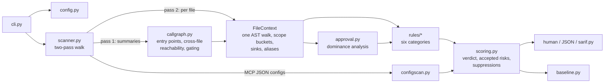

<div align="center">

# 🛡️ agentgauge

**A zero-dependency static scanner for MCP servers and AI-agent tool code: does every action a model can trigger have a human, a log, a limit and a validated input in front of it?**

[](https://github.com/PreethamNoelP/agentgauge/actions/workflows/ci.yml)


</div>

---

## What it does

agentgauge finds the functions a model can call — MCP tools, LangChain,
OpenAI Agents SDK, LlamaIndex, Pydantic AI, AutoGen and Semantic Kernel
tools — follows everything they call across your repository, and checks
each destructive action it reaches:

```console
$ agentgauge tests/fixtures/vulnerable_server.py

  Human oversight                      0.0 / 25  (0/24 sites passed)
  Audit logging                        0.0 / 20  (0/25 sites passed)
  Rate limiting                        0.0 / 15  (0/25 sites passed)
  Error handling                       0.0 / 15  (0/25 sites passed)
  Tool scope & input validation        0.0 / 15  (0/22 sites passed)
  Permissive defaults                  0.0 / 10  (0/2 sites passed)
  ----------------------------------------------------------
  GOVERNANCE SCORE                     0.0 / 100
  VERDICT                           FAIL_CRITICAL
  APPLICABLE SITES                  123
  PASS THRESHOLD                    70
  TOOL ENTRY POINTS                 25
  NOT AGENT-REACHABLE               1 sensitive call(s), not judged

  tests/fixtures/vulnerable_server.py:91  [human-oversight]
    file delete call 'shutil.rmtree' in 'model_confirms_itself' is gated only by a tool argument, which the model chooses
    fix: Get the approval from a human, not from the tool's input: MCP elicitation (`await ctx.elicit(...)`), a confirmation UI, or an approval service checked before the call
  ...
```

It never executes the code it reads: `ast.parse` and `tokenize` only.

## Why it is built this way

**Only agent-reachable code is judged.** A `subprocess.run` in a build
script is not an agent risk; one reached from an `@mcp.tool()` is, even
three helper calls and two files away. agentgauge builds a whole-program
call graph from the recognized tool entry points and judges exactly what
they reach. Everything else is counted and reported as not agent-reachable,
not judged. On `pip`, `requests` and `black` it reports zero critical
findings and says no tool entry points were recognized (`INCOMPLETE`),
instead of failing them for their own cache and build code.

**Approval has to come first, from a human.** A sensitive call passes only
when an approval check *dominates* it — an enclosing condition, an earlier
guard (`if not await ctx.elicit(...)... return`), an approval decorator, or
the same at every call site of the helper that contains it. None of these
count: a check placed after the call, a tool argument named `confirm` (the
model sets it), `approved = True`, `if settings.auto_approve:`, machine
authorization (`is_authorized`), or vocabulary lookalikes (`humanize`).

**A verdict, not just a score.** The 0–100 score averages every site, so one
ungated payment hides behind ninety-nine governed ones. The verdict cannot
be averaged:

| Verdict | Meaning | Exit |
|---|---|---|
| `FAIL_CRITICAL` | an agent-reachable file delete, shell or code exec, dynamic SQL, payment or remote delete has no approval check before it | 1 |
| `FAIL_SCORE` | no critical finding, but the score is below the threshold (default 70) | 1 |
| `INCOMPLETE` | a file could not be parsed, the oversight rule is disabled, nothing applicable was found, or no tool was recognized | 0 (1 with `--fail-on-incomplete`) |
| `PASS` | none of the above | 0 |

Neither an inline suppression nor a baseline clears a critical finding. A
reviewed `accepted_risks` entry in config does — with a mandatory written
reason that every report repeats.

**Measured, including where it is wrong.** A labelled benchmark corpus runs
in CI and fails the build if results drift from the labels in either
direction. Current numbers, over the four rules a reviewer can judge
independently:

| Rule | Precision | Recall |
|---|---:|---:|
| human-oversight | 77.3% | 85.0% |
| input-validation | 81.8% | 100.0% |
| error-handling | 91.7% | 100.0% |
| permissive-defaults | 100.0% | 100.0% |
| **all measured rules** | **83.0%** | **92.9%** |

Critical-verdict accuracy 13/13. The corpus is written for the benchmark in
the shape of real servers, not sampled from the wild, and it includes the
cases agentgauge gets wrong today — see
[benchmarks/README.md](benchmarks/README.md) for exactly what that means.

## The six categories

| Category | Weight | The question |
|---|---|---|
| Human oversight | 25 | Is every reachable destructive action preceded by a human approval? |
| Audit logging | 20 | Does every tool, or something it calls, record what it did? |
| Rate limiting | 15 | Is every tool behind a limiter, or a declared external one? |
| Error handling | 15 | Are destructive actions' failures handled — not swallowed — and can agent loops end? |
| Input validation | 15 | Are risky inputs (paths, commands, queries, URLs — parameters, Pydantic fields, `arguments[...]`) validated before use? |
| Permissive defaults | 10 | Is `auto_approve=True` / `verify=False` set in code or in an MCP client config file? |

Every heuristic, its evidence and its known blind spots are in
[RULES.md](RULES.md).

## Installation

Python 3.11+, nothing else.

```console
$ pip install git+https://github.com/PreethamNoelP/agentgauge.git
$ agentgauge --version
```

## Usage

```console
$ agentgauge .                              # scan from the repository root
$ agentgauge src/server.py                  # a single file
$ agentgauge . --json                       # machine-readable report
$ agentgauge . --sarif > agentgauge.sarif   # GitHub/GitLab code scanning
$ agentgauge . --min-score 80               # stricter PASS threshold (0 disables)
$ agentgauge . --fail-on-incomplete         # treat reduced coverage as a failure
$ agentgauge . --scope all                  # judge every function with a sink
$ agentgauge . --baseline base.json --update-baseline   # record today's findings
$ agentgauge . --baseline base.json         # fail only on new findings
```

Run from the repository root: reported paths are relative to the working
directory, which is what a SARIF upload needs.

### Configuration

`[tool.agentgauge]` in `pyproject.toml` next to the scan target:

```toml
[tool.agentgauge]
min_score = 70
exclude = ["tests/*", "scripts/"]
extra_tool_decorators = ["expose"]         # your framework's tool decorator
extra_approval_markers = ["greenlight"]    # your approval helper's vocabulary
assume_external_rate_limiting = true       # a gateway limits calls

[[tool.agentgauge.accepted_risks]]
rule = "human-oversight"
file = "src/server.py"
function = "rebuild_index"
reason = "Runs a fixed make target; no model input reaches it (SEC-142)"
```

Validation is strict: an unknown key, a typo'd rule id, a vocabulary entry
that would match almost everything, or an approval marker that matches a
sink's own name (`"run"`) is an error, not a silent no-op. The full
reference is in [RULES.md](RULES.md#configuration).

### GitHub Actions

```yaml
- uses: PreethamNoelP/agentgauge@<commit-sha>
  with:
    path: .
    fail-on-incomplete: "true"
```

With code scanning — the step still exits with the governance result:

```yaml
- uses: PreethamNoelP/agentgauge@<commit-sha>
  with:
    sarif-file: agentgauge.sarif
  continue-on-error: true
- uses: github/codeql-action/upload-sarif@v3
  with:
    sarif_file: agentgauge.sarif
```

Inputs: `path`, `min-score`, `scope`, `fail-on-incomplete`, `sarif-file`,
`config`. The action installs agentgauge from its own checkout, so what runs
is exactly the ref you pinned. Pin a full commit SHA until release tags are
published.

### pre-commit

```yaml
repos:
  - repo: https://github.com/PreethamNoelP/agentgauge
    rev: <commit-sha>
    hooks:
      - id: agentgauge
        args: [--fail-on-incomplete]
```

The hook scans the whole repository, not the staged files: reachability and
the score are whole-program properties.

## What leaves your machine: nothing

| | |
|---|---|
| **Network** | None. The package imports `argparse, ast, collections, dataclasses, fnmatch, functools, hashlib, io, json, os, pathlib, re, sys, tokenize, tomllib, typing` and nothing else. No HTTP client, socket, DNS lookup or update check. |
| **Files written** | Only the baseline file you name with `--update-baseline`. |
| **Files read** | `.py` files and known MCP config files under the target, plus one config file. Symlinks pointing outside the scan root are refused. |
| **Code execution** | None. Scanned code is never imported, evaluated or run. |
| **Environment** | Never read. |
| **Dependencies** | Zero at runtime. |

The report itself contains file paths, function and parameter names,
resolved call names and flag names from your code — never string literals,
secret values or source lines. Treat an uploaded SARIF or JSON report with
the same care as your identifier names. Each claim above is enforced by a
test in `tests/test_invariants.py`; [SECURITY.md](SECURITY.md) says what
counts as a vulnerability.

## Architecture


```mermaid
flowchart LR
    CLI[cli.py] --> CFG[config.py]
    CLI --> SC[scanner.py<br/>two-pass walk]
    SC -->|pass 1: summaries| CG[callgraph.py<br/>entry points, cross-file<br/>reachability, gating]
    SC -->|pass 2: per file| CTX[FileContext<br/>one AST walk, scope buckets,<br/>sinks, aliases]
    CG --> CTX
    CTX --> AP[approval.py<br/>dominance analysis]
    CTX --> R[rules/*<br/>six categories]
    AP --> R
    SC -->|MCP JSON configs| JCS[configscan.py]
    R --> AG[scoring.py<br/>verdict, accepted risks,<br/>suppressions]
    JCS --> AG
    AG --> OUT[human / JSON / sarif.py]
    AG --> BL[baseline.py]
```

- **Rules report facts; scoring turns them into numbers.** Each rule module
  exposes `RULE_ID`, `CATEGORY`, `WEIGHT` and `check(ctx) -> (sites,
  passed, findings)`. See [CONTRIBUTING.md](CONTRIBUTING.md).
- **One walk per file.** `FileContext` builds the node list, parent map,
  per-scope node buckets and definition index in a single traversal that
  every rule shares.
- **Two passes, bounded memory.** Pass one keeps only small per-file
  summaries (no AST nodes) for the cross-file index; parsed files are reused
  in pass two up to 40 MB of source, after which they are re-parsed.

## Validation

- **1,169 tests** — per rule, approval dominance, call graph and cross-file
  reachability, invariants over an awkward-syntax corpus, CLI, config,
  SARIF, end-to-end — plus `mypy --strict` and `ruff`, on Linux and Windows,
  Python 3.11–3.13.
- **Fixtures pinned at both ends:** the vulnerable fixture scores exactly
  0.0 across 123 sites with every bypass shape named in a test; the clean
  fixture scores exactly 100.0 across 48 sites.
- **Benchmark gate:** the labelled corpus must match exactly.
- **Package gate:** CI builds the wheel, installs it into an empty
  virtualenv and runs the fixture gates against the installed command.

## Limits

agentgauge is a heuristic static analyzer. It does not trace data flow
beyond one or two assignments, check the polarity of an approval test, see
sinks behind dict dispatch or non-constant `getattr`, read TypeScript or
JavaScript servers, or know that a decorator named `@guarded` asks a human.
Rules 2 and 3 check that logging and rate-limiting code is present, not that
it is correct. A 100/100 is not a certification; [RULES.md](RULES.md) lists
every blind spot, and the benchmark keeps the known ones in the numbers.

## Roadmap

- [ ] Publish release tags and a PyPI package
- [ ] A labelled corpus of real open-source MCP servers for the benchmark
- [ ] Approval polarity and deeper value tracking
- [ ] TypeScript/JavaScript MCP servers
- [ ] Plugin entry points for third-party rules
- [ ] New categories: secrets exposure, SSRF, excessive tool scope

## Contributing

Reports of false positives and false negatives are the most useful
contribution — the issue template asks for a minimal snippet, which becomes
a benchmark case. See [CONTRIBUTING.md](CONTRIBUTING.md).

## License

[MIT](LICENSE). Author: **Preetham Noel P** —
[GitHub](https://github.com/PreethamNoelP) ·
[LinkedIn](https://www.linkedin.com/in/preethamnoelp)
